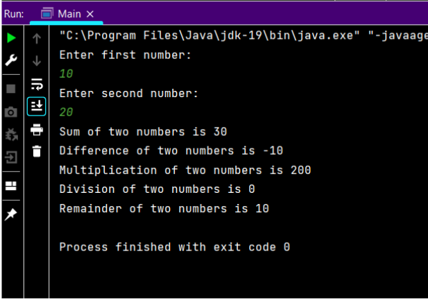
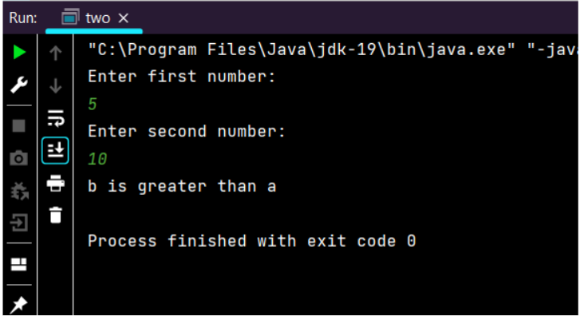
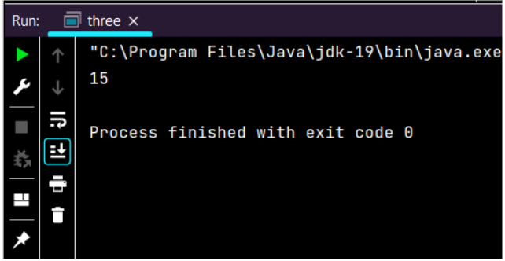
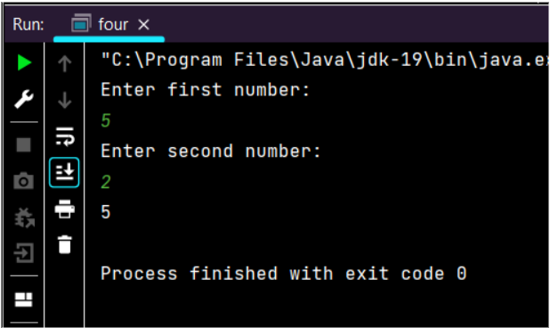
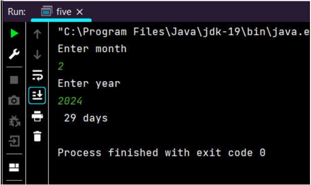
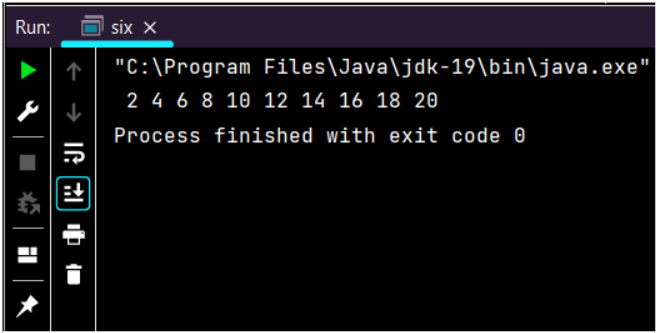
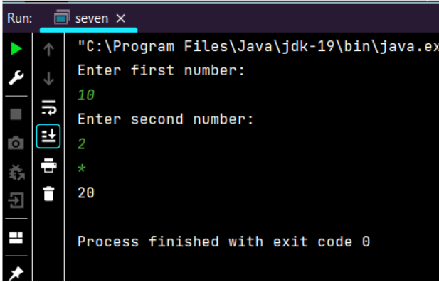
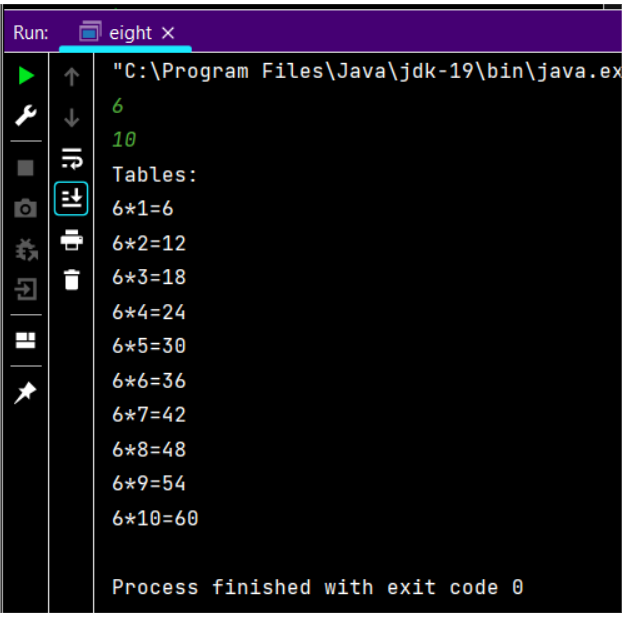

# ASSIGNMENT-1
## NAME:K.BALAJI
## REG NO : 212221230011
## SECOND YEAR AI-DS

### 1.Write a Java program to print the sum, multiply, subtract, divide and remainder of two numbers
```
import java.util.Scanner;

public class Main {
    public static void main(String[] args)
    {
        Scanner sc = new Scanner(System.in);
        System.out.println("Enter first number:");
        int a =  sc.nextInt();
        System.out.println("Enter second number:");
        int b =  sc.nextInt();
        System.out.println("Sum of two numbers is "+(a+b));
        System.out.println("Difference of two numbers is "+(a-b));
        System.out.println("Multiplication of two numbers is "+(a*b));
        System.out.println("Division of two numbers is "+(a/b));
        System.out.println("Remainder of two numbers is "+(a%b));
    }
}

```
### Output :


### 2.Write a Java program to compare two numbers
```
import java.util.Scanner;

public class two
{
    public static void main(String[] args)
    {
        Scanner sc = new Scanner(System.in);
        System.out.println("Enter first number:");
        int a = sc.nextInt();
        System.out.println("Enter second number:");
        int b = sc.nextInt();
        if(a>b)
        {
            System.out.println("a is greater than b");
        }
        else if(b>a)
        {
            System.out.println("b is greater than a");
        }
        else if(a==b) {
            System.out.println("a and b are equal");
        }
        else {
            System.out.println("number is zero");
        }
    }
}
```

### Output :


### 3.Write a Java program to convert a string to an integer
```
public class three
{
    public static void main(String[] args)
    {
        String str = "15";
        int a = Integer.parseInt(str);
        System.out.println(a);
    }
}

```
### Output :


### 4.Java Program to find area of rhombus
```
import java.util.Scanner;

public class four
{
    public static void main(String[] args)
    {
        Scanner sc = new Scanner(System.in);
        System.out.println("Enter first number:");
        int d1=sc.nextInt();
        System.out.println("Enter second number:");
        int d2=sc.nextInt();
        int rh = d1*d2/2;
        System.out.println(rh);
    }
}

```
### Output :


### 5.Write a Java program to find the number of days in a month
```
import java.util.Scanner;

public class five {
    public static void main(String[] args)
    {
        Scanner sc = new Scanner(System.in);
        System.out.println("Enter month");
        int month = sc.nextInt();
        System.out.println("Enter year");
        int year = sc.nextInt();;
        if(month==1||month==3||month==5||month==7||month==8||month==10||month==12)
        {
            System.out.println("month has 31 days");
        }
        else if(month==4||month==6||month==9||month==11)
        {
            System.out.println("month has 30 days");
        }
        else {
            if(year%4==0 || year%400==0 && year%100!=0)
            {
                System.out.println(" 29 days");
            }
            else
            {
                System.out.println("28 days");
            }
        }
    }
}

```
### Output :


### 6.Write a Java program to print the even numbers from 1 to 20
```
public class six {
    public static void main(String[] args)
    {
        for(int i=1;i<=20;i++)
        {
            if(i%2==0) 
            {
                System.out.print(" " + i);
            }
        }
    }
}


```
### Output :


### 7.Write a Java program to create a simple calculator
```
import java.util.Scanner;

public class seven
{
    public static void main(String[] args)
    {
         Scanner s = new Scanner(System.in);
         System.out.println("Enter first number:");
         int a = s.nextInt();
        System.out.println("Enter second number:");
         int b = s.nextInt();
         String str = s.next();
         switch(str)
         {
             case "+":
                 System.out.println(a+b);
                 break;

             case "-":
                 System.out.println(a-b);
                 break;

             case "*":
                 System.out.println(a*b);
                 break;

             case "/":
                 System.out.println(a/b);
                 break;

             case "%":
                 System.out.println(a%b);
                 break;

             case "&":
                 System.out.println(a&b);
                 break;

             case "|":
                 System.out.println(a|b);
                 break;

             case "^":
                 System.out.println(a^b);
                 break;

             default:
                 System.out.println("number is invalid");
                 break;

         }

    }
}

```
### Output :


### 8.Write a Java program to print multiplication table of given number
```
import java.util.Scanner;

public class eight
{
    public static void main(String[] args)
    {
        Scanner sq=new Scanner(System.in);
        int f=sq.nextInt();
        int s=sq.nextInt();
        int i;
        System.out.println("Tables:");
        for(i=1;i<=s;i++)
        {
            System.out.println(f+"*"+i+"="+(f*i));
        }
    }
}

```
### Output :

